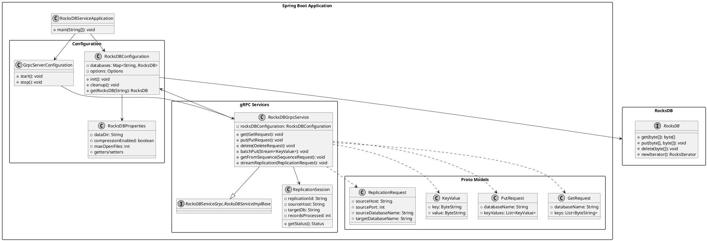

```plantuml
@startuml RocksDB Server Architecture

skinparam componentStyle uml2
skinparam packageStyle rectangle
skinparam monochrome true
skinparam shadowing false

package "Spring Boot Application" {
    class RocksDBServiceApplication {
        + main(String[]): void
    }

    package "Configuration" {
        class RocksDBConfiguration {
            - databases: Map<String, RocksDB>
            - options: Options
            + init(): void
            + cleanup(): void
            + getRocksDB(String): RocksDB
        }

        class RocksDBProperties {
            - dataDir: String
            - compressionEnabled: boolean
            - maxOpenFiles: int
            + getters/setters
        }

        class GrpcServerConfiguration {
            + start(): void
            + stop(): void
        }
    }

    package "gRPC Services" {
        interface "RocksDBServiceGrpc.RocksDBServiceImplBase" as ServiceBase
        
        class RocksDBGrpcService {
            - rocksDBConfiguration: RocksDBConfiguration
            + get(GetRequest): void
            + put(PutRequest): void
            + delete(DeleteRequest): void
            + batchPut(Stream<KeyValue>): void
            + getFromSequence(SequenceRequest): void
            + streamReplication(ReplicationRequest): void
        }

        class ReplicationSession {
            - replicationId: String
            - sourceHost: String
            - targetDb: String
            - recordsProcessed: int
            + getStatus(): Status
        }
    }

    package "Proto Models" {
        class GetRequest {
            + databaseName: String
            + keys: List<ByteString>
        }

        class PutRequest {
            + databaseName: String
            + keyValues: List<KeyValue>
        }

        class KeyValue {
            + key: ByteString
            + value: ByteString
        }

        class ReplicationRequest {
            + sourceHost: String
            + sourcePort: int
            + sourceDatabaseName: String
            + targetDatabaseName: String
        }
    }
}

package "RocksDB" {
    interface RocksDB {
        + get(byte[]): byte[]
        + put(byte[], byte[]): void
        + delete(byte[]): void
        + newIterator(): RocksIterator
    }
}

' Relationships
RocksDBServiceApplication --> RocksDBConfiguration
RocksDBServiceApplication --> GrpcServerConfiguration

RocksDBGrpcService --|> ServiceBase
RocksDBGrpcService --> RocksDBConfiguration
RocksDBGrpcService --> ReplicationSession

RocksDBConfiguration --> RocksDBProperties
RocksDBConfiguration --> RocksDB

GrpcServerConfiguration --> RocksDBGrpcService

RocksDBGrpcService ..> GetRequest
RocksDBGrpcService ..> PutRequest
RocksDBGrpcService ..> KeyValue
RocksDBGrpcService ..> ReplicationRequest

@enduml
```
